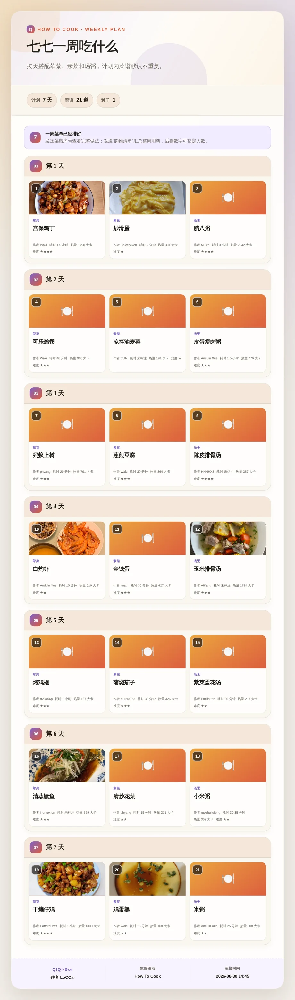
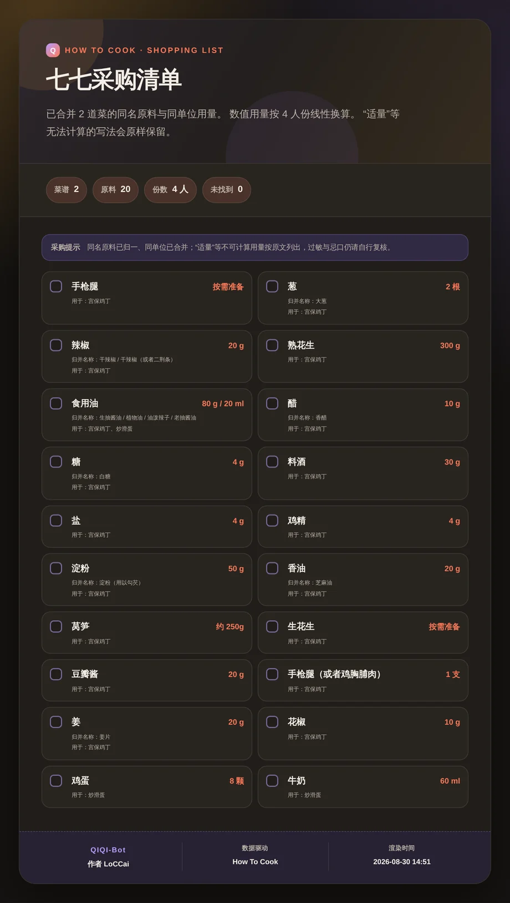

# nonebot-plugin-how-to-cook

面向 [HowToCook API](https://github.com/LoCCai/HowToCook-API) 的完整 NoneBot2 客户端。除了菜名搜索，它还提供 1–14 天六槽位膳食计划、跨菜谱购物清单、忌口标签过滤、按人数换算用量、随机推荐、荤菜/素菜/汤/早餐/饮料/甜品自动配餐、按手头原料找菜、相似菜谱、聚合搜索、全库统计和只读内容变更记录，并覆盖全部菜谱/技巧资源。

插件默认使用设计过的 HTML 长图卡片，也可以全局配置或按命令切换为合并消息、单消息、组合消息。搜索只有一个结果时直接展示完整菜谱；存在多个结果时，用户回复卡片序号即可继续。长图超过设定大小或高度后会自动转成群文件。

## 卡片预览

| 搜索选择列表（白天） | 完整菜谱详情（夜间） |
| --- | --- |
|  |  |
| **智能配餐（白天）** | **全库统计（夜间）** |
|  |  |
| **一周膳食计划（白天）** | **采购清单（夜间）** |
|  |  |

## 功能

- 模糊搜索：中文标题、拼音全拼、拼音首字母、原料与正文
- 一周计划：六槽位均可设为 0–3，支持 `1,2,1` 逐日循环数量、1–14 天、可复现种子、上游内嵌整周清单与最高难度
- 购物清单：接受完整菜名或稳定 ID；归一同义原料、合并同单位数量，并保留“适量”等原文
- 计划联动：配餐后回复 `合并详情 [人数]`，一次查看整桌完整菜谱卡与购物清单；周计划回复 `第1天 [人数]` 查看当天，或回复 `全部详情 [人数]` 合并整周
- 清单联动：配餐或周计划卡片后直接回复 `购物清单` / `购物清单 4`，单独汇总整桌或整周用料
- 忌口筛选：素食、含辣、水产、花生、蛋类、乳制品、麸质标签；支持中文参数（启发式结果不替代医学判断）
- 份数换算：菜谱原料与购物清单支持 1–100 人份；静态数量按菜谱基准缩放，公式型每份量按人数缩放，并保留原量与换算说明
- 随机推荐：支持数量、分类、难度、忌口标签与可复现种子
- 智能配餐：自动组合荤菜/水产、素菜、汤与粥、早餐、饮品和甜品，可调槽位、人数、最高难度与忌口标签
- 食材找菜：显示原料覆盖率、已有数量、缺少原料，支持宽松/严格模式与常见别名
- 相似推荐：按原料重合度和同分类权重发现相关菜谱
- 聚合搜索：一次同时搜索菜谱与厨房技巧
- 数据统计：分类、难度、烹饪方式、高频原料与平均热量可视化卡片
- 内容版本：查看当前提交、联网检查上游与最近 1–365 天新增/更新；聊天命令不开放实际更新
- 智能选择：任一发现功能只有一个候选时直达详情；多个候选使用 waiter 等待发起者回复序号；同一会话的新计划会使旧卡片等待失效，回复只触发最新一次
- 搜索卡片：每项左侧成品图，右侧展示标题、作者、耗时、热量、难度、分类与烹饪方式
- 完整筛选：分类、难度、最高难度、原料、饮食标签、忌口标签、排序、分页、字段和图片模式
- 完整菜谱：元信息、原料、工具、步骤、段落、备注、图片、Markdown、HTML、原文与 schema.org JSON-LD
- 烹饪技巧：列表、搜索、分组、详情、元信息、Markdown、HTML 与原文
- 安全方法边界：通用入口只开放已知 GET 路由与 `assets`；仅明确开放无状态的购物清单 POST，始终拒绝内容更新 POST
- 四种输出：`forward`、`single`、`combined`、`render`
- 自动昼夜主题：默认按 `Asia/Shanghai` 在 23:00–08:00 使用夜间卡片
- 直连优先：先忽略进程代理直连 API，仅在传输失败后按配置尝试环境代理
- 慢图容错：DOM 就绪后在独立上限内等待图片，超时保留已加载资源继续截图，不再被固定 30 秒 `networkidle` 整卡打回文本
- 安全降级：渲染真正失败后降级文本模式；群文件上传结果未知时不自动重传

## 安装

```bash
pip install git+https://github.com/LoCCai/nonebot-plugin-how-to-cook.git
```

使用 `nb-cli` 或 NoneBot 配置加载 `nonebot_plugin_how_to_cook`。插件依赖 `nonebot-plugin-htmlrender` 0.7.x 与 `nonebot-plugin-waiter` 0.8.x，并支持 OneBot V11。

HowToCook API 需要单独部署。API 默认示例地址为 `http://127.0.0.1:3000/api`，插件不包含菜谱内容，也不会在服务端抓取外部网页。

## 指令

主命令为 `做饭`，别名为 `怎么做`。七七现有的自然语言“今天吃什么”继续由随机吃喝功能处理，避免两个插件同时响应。

```text
做饭 帮助
做饭 健康
做饭 分类
做饭 统计
做饭 内容版本
做饭 内容检查
做饭 更新日志 30 --数量 8

做饭 随机
做饭 随机 3 --分类 soup --难度 2 --忌口 花生 --种子 weekend
做饭 配餐
做饭 配餐 --荤 2 --素 1 --汤 1 --早餐 1 --饮料 1 --甜品 1 --人数 4 --忌口 海鲜 --种子 family
做饭 周计划
做饭 周计划 7 --荤 1,2,1 --素 1 --汤 1,0 --早餐 1,0 --饮料 0,1 --甜品 0,0,1 --人数 4 --忌口 辣,海鲜 --种子 family
# 配餐卡片后回复：合并详情 或 合并详情 4人
# 周计划卡片后回复：第1天 / 第1天 4人 / 全部详情 / 全部详情 4人
# 只需要清单时回复：购物清单 或 购物清单 4
做饭 购物清单 宫保鸡丁,炒滑蛋 --份数 4
做饭 食材 鸡蛋 西红柿
做饭 食材 番茄 鸡蛋 --严格 --数量 8
做饭 相关 0e9866e564 --数量 5

做饭 搜索 红烧肉
做饭 hsr
做饭 搜索 土豆 --原料 牛肉 --最高难度 3 --排序 difficulty --页 1
做饭 搜索 --标签 素食 --忌口 辣,麸质
做饭 全局搜索 备菜

# 若返回多个结果，直接回复 1、2、3……；发送“取消”可结束
# 若只有一个结果，插件会直接展示完整菜谱

做饭 详情 0eb9f4426a
做饭 元信息 0eb9f4426a
做饭 原料 0eb9f4426a
做饭 原料 0eb9f4426a --份数 4
做饭 工具 0eb9f4426a
做饭 步骤 0eb9f4426a
做饭 段落 0eb9f4426a
做饭 备注 0eb9f4426a
做饭 图片 0eb9f4426a
做饭 Markdown 0eb9f4426a
做饭 HTML 0eb9f4426a
做饭 原文 0eb9f4426a
做饭 JSONLD 0eb9f4426a

做饭 技巧
做饭 技巧 厨房 --分组 advanced
做饭 技巧详情 f41f2354ac
做饭 技巧元信息 f41f2354ac
做饭 技巧MD f41f2354ac
做饭 技巧HTML f41f2354ac
做饭 技巧原文 f41f2354ac

做饭 接口 recipes q=番茄 page_size=5 image_mode=server
做饭 接口 menu seed=dinner max_difficulty=3
做饭 接口 plan/week seed=week days=7 exclude_tags=seafood
做饭 接口 content/changelog days=30
做饭 接口 stats
```

稳定 ID 与 URL 编码后的仓库相对路径都可以作为菜谱/技巧标识。
日常查询无需复制 ID；`详情 <ID>` 主要用于收藏后的直达调用和完整 API 子资源访问。

在 QIQI-Bot 中，菜谱搜索、随机推荐、配餐、周计划、更新日志、食材找菜、相似推荐、技巧列表和聚合搜索共用一套 `keep_session=True` 序号选择。序号提示与超时/取消提示会复用 `src.utils.message_fx.send_with_auto_recall` 自动撤回；独立部署时会安全降级为普通提示消息。配餐与周计划还在同一个 waiter 中识别 `购物清单 [人数]`、`合并详情 [人数]`、`第N天 [人数]` 与 `全部详情 [人数]`，无需复制任何菜谱 ID。周计划默认请求 API 的内嵌整周购物清单，因此超过独立清单接口 50 道上限时仍能直接展示；需要指定人数时可在周计划命令追加 `--人数 N`。合并详情会把每道完整 HTML 菜谱卡渲染成图片节点，并把对应购物清单放在末尾；在 QIQI 中会先用 `prepare_exact_delivery_message` 物化图片，再把 `forward` 载荷完整交给 `send_combined_message`，统一复用禁言检查、内容转换、合并分块、超大图转文件和发送回退。

`做饭 内容检查` 只调用 API 的只读 `GET /api/content/check`。插件不提供 `POST /api/content/update` 聊天命令，受控通用入口也不允许绕过这一边界。

`做饭 购物清单` 调用的是 API 明确提供的无状态计算端点 `POST /api/shopping-list`：它只根据传入菜谱汇总响应，不更新菜谱内容或服务配置。该端点只能通过专用命令调用，不能借通用接口命令发起任意 POST。

### 忌口与饮食标签

以下中文值会转换成 API 标签，可用逗号、中文逗号或顿号分隔：

| 中文 | API 值 | 说明 |
| --- | --- | --- |
| 素食 | `vegetarian` | 原料中未启发式识别到肉、禽、水产、蛋、奶 |
| 辣 | `spicy` | 含辣椒、花椒、胡椒等关键词 |
| 海鲜 / 水产 | `seafood` | 水产分类或含鱼虾蟹贝等关键词 |
| 花生 / 蛋 / 乳制品 / 麸质 | `peanut` / `egg` / `dairy` / `gluten` | 常见过敏原关键词 |

搜索可用 `--标签` 指定必须包含的标签，并用 `--忌口` 排除；随机、配餐和周计划支持 `--忌口`。这些标签来自原料文本的启发式判断，不是营养数据库结论，也不能替代医疗建议或人工核对。

### 单次覆盖输出与主题

任意命令可追加：

```text
--模式 合并|单条|组合|渲染
--主题 自动|白天|夜间
```

例如：

```text
做饭 详情 0eb9f4426a --模式 组合
做饭 技巧详情 f41f2354ac --模式 渲染 --主题 夜间
```

四种模式的行为：

| 模式 | 配置值 | 行为 |
| --- | --- | --- |
| 合并消息 | `forward` | 普通内容按自然边界拆成 OneBot 合并转发节点；配餐/周计划直接合并完整菜谱卡图片与购物清单 |
| 单消息 | `single` | 摘要、成品图和完整文本放在一条消息内 |
| 组合消息 | `combined` | 先发摘要与成品图，再发详细文本消息 |
| 全局渲染 | `render` | Markdown 转 HTML，使用完整卡片布局输出长图 |

## 配置

所有配置均可写入 NoneBot 使用的 `.env`。布尔值使用 `true/false`。

| 配置项 | 默认值 | 说明 |
| --- | --- | --- |
| `HOW_TO_COOK_API_BASE_URL` | `http://127.0.0.1:3000/api` | API 基址，必须包含 `/api` |
| `HOW_TO_COOK_REQUEST_TIMEOUT` | `15` | HTTP 超时秒数 |
| `HOW_TO_COOK_DIRECT_FIRST` | `true` | 优先使用不读取环境代理的直连请求 |
| `HOW_TO_COOK_PROXY_FALLBACK` | `true` | 直连发生传输错误后尝试环境代理 |
| `HOW_TO_COOK_IMAGE_MODE` | `server` | `relative` / `server` / `proxy` |
| `HOW_TO_COOK_DEFAULT_PAGE_SIZE` | `8` | 搜索与技巧默认每页数量 |
| `HOW_TO_COOK_MAX_PAGE_SIZE` | `20` | Bot 单次展示上限 |
| `HOW_TO_COOK_SELECTION_TIMEOUT_SECONDS` | `120` | 多结果搜索等待发起者回复序号的秒数 |
| `HOW_TO_COOK_REMINDER_RECALL_SECONDS` | `15` | QIQI 提醒消息自动撤回延迟秒数 |
| `HOW_TO_COOK_RESPONSE_MODE` | `render` | 全局输出模式 |
| `HOW_TO_COOK_RENDER_FALLBACK_MODE` | `forward` | HTML 渲染失败后的文本模式 |
| `HOW_TO_COOK_MESSAGE_CHUNK_SIZE` | `3200` | 组合模式文本分段长度 |
| `HOW_TO_COOK_FORWARD_NODE_SIZE` | `1800` | 合并转发节点长度 |
| `HOW_TO_COOK_FORWARD_NAME` | `七七 · 今天吃什么` | 合并转发节点昵称 |
| `HOW_TO_COOK_FORWARD_TIMEOUT_SECONDS` | `120` | 七七合并转发组件单次发送超时 |
| `HOW_TO_COOK_BUNDLE_FETCH_CONCURRENCY` | `3` | 合并详情并发读取完整菜谱的数量 |
| `HOW_TO_COOK_THEME` | `auto` | `auto` / `light` / `dark` |
| `HOW_TO_COOK_TIMEZONE` | `Asia/Shanghai` | 自动主题时区 |
| `HOW_TO_COOK_DARK_START` | `23:00` | 夜间主题开始时间 |
| `HOW_TO_COOK_DARK_END` | `08:00` | 夜间主题结束时间 |
| `HOW_TO_COOK_RENDER_WIDTH` | `920` | CSS 像素宽度 |
| `HOW_TO_COOK_RENDER_SCALE` | `1.5` | 浏览器截图缩放倍数 |
| `HOW_TO_COOK_RENDER_WAIT_MS` | `200` | 图片结束后额外等待布局稳定的毫秒数 |
| `HOW_TO_COOK_RENDER_TIMEOUT_SECONDS` | `90` | DOM 装载与浏览器截图各自的超时秒数 |
| `HOW_TO_COOK_RENDER_IMAGE_WAIT_SECONDS` | `90` | 卡片图片资源等待上限；超时后保留已加载内容继续截图 |
| `HOW_TO_COOK_LARGE_IMAGE_BYTES` | `8388608` | 超过此字节数转群文件 |
| `HOW_TO_COOK_LARGE_IMAGE_HEIGHT` | `14000` | 超过此 PNG 高度转群文件 |
| `HOW_TO_COOK_IMAGE_DOWNLOAD_BYTES` | `12582912` | 成品图下载上限 |
| `HOW_TO_COOK_UPLOAD_LARGE_GROUP_FILE` | `true` | 群聊中过大长图转群文件 |

示例：

```dotenv
HOW_TO_COOK_API_BASE_URL=http://your-api-host:3000/api
HOW_TO_COOK_RESPONSE_MODE=render
HOW_TO_COOK_THEME=auto
HOW_TO_COOK_TIMEZONE=Asia/Shanghai
HOW_TO_COOK_DARK_START=23:00
HOW_TO_COOK_DARK_END=08:00
```

夜间区间可以跨午夜，也可以配置成普通日内区间；开始与结束相同时表示全天夜间主题。

## API 响应兼容

结构化接口按 `{ "data": ..., "meta": ... }` 解包，错误按 `{ "error": { "code", "message" } }` 展示。`markdown`、`html`、`raw` 和静态资源接口实际返回对应的文本或二进制内容；JSON-LD 返回 `application/ld+json`。客户端均按 `Content-Type` 处理，不强制要求 JSON 外壳。

新版原料字段 `per_serving`、`quantity_note`、`quantity_original` 与 `scaled` 会直接进入卡片说明：公式型数量标明“每份基准”和取整等换算备注，中文数量词与冒号格式采用 API 规范化后的数量，缩放后仍展示原始用量；无法可靠计算的“适量/若干”继续原样保留。

请求 `servings` 时，原料卡会同时展示响应 `meta.factor`（静态数量按“目标份数 ÷ 菜谱基准份数”缩放）、`meta.per_serving_factor`（公式型每份量按目标份数缩放）以及上游 `meta.note`。因此 `servings=1` 时可以清楚看到静态系数可能为 `0.5`、每份量系数为 `1`；公式型数量保持不变是每份语义，不是缩放失败。若连接尚未提供双系数字段的旧版 API，卡片会回退到原有说明，不影响查询。

通用接口命令不会接受任意 URL、请求体或非 GET 方法，也拒绝路径穿越。它允许访问当前配置的 HowToCook API 下已知只读路由，包括 `random`、`menu`、`plan/week`、`by-ingredients`、`related`、JSON-LD、聚合搜索、统计、changelog、OpenAPI 和内容版本/检查；实际内容更新始终排除。计算型购物清单只能由专用命令调用。

## 开发验证

```bash
python -m pytest -q
ruff check .
ruff format --check .
python -m build
```

菜谱正文来自 [Anduin2017/HowToCook](https://github.com/Anduin2017/HowToCook) 社区贡献者；内容许可与署名以源仓库为准。插件源码使用 MIT License。
