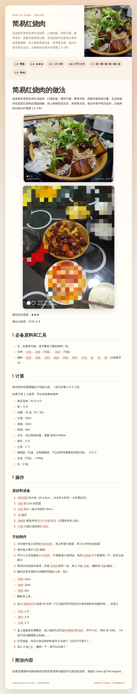
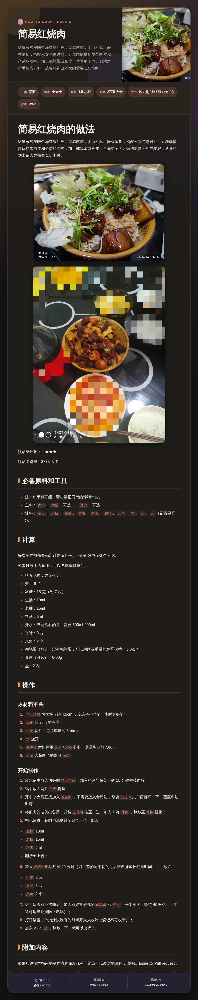
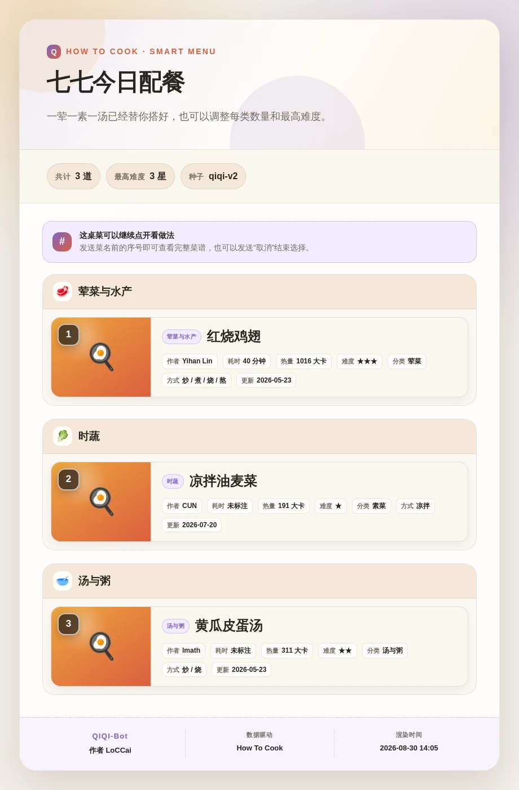
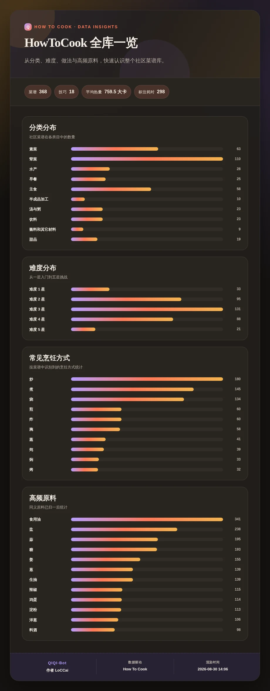

# nonebot-plugin-how-to-cook

面向 [HowToCook API](https://github.com/LoCCai/HowToCook-API) 的完整 NoneBot2 客户端。除了菜名搜索，它还提供随机推荐、荤素汤自动配餐、按手头原料找菜、相似菜谱、菜谱与技巧聚合搜索、全库统计和只读内容版本检查，并覆盖全部原有菜谱/技巧资源。

插件默认使用设计过的 HTML 长图卡片，也可以全局配置或按命令切换为合并消息、单消息、组合消息。搜索只有一个结果时直接展示完整菜谱；存在多个结果时，用户回复卡片序号即可继续。长图超过设定大小或高度后会自动转成群文件。

## 卡片预览

| 搜索选择列表（白天） | 完整菜谱详情（夜间） |
| --- | --- |
|  |  |
| **智能配餐（白天）** | **全库统计（夜间）** |
|  |  |

## 功能

- 模糊搜索：中文标题、拼音全拼、拼音首字母、原料与正文
- 随机推荐：支持数量、分类、难度与可复现种子
- 智能配餐：自动组合荤菜/水产、素菜和汤，可调槽位数量与最高难度
- 食材找菜：显示原料覆盖率、已有数量、缺少原料，支持宽松/严格模式与常见别名
- 相似推荐：按原料重合度和同分类权重发现相关菜谱
- 聚合搜索：一次同时搜索菜谱与厨房技巧
- 数据统计：分类、难度、烹饪方式、高频原料与平均热量可视化卡片
- 内容版本：查看当前内容提交并联网检查上游；聊天命令不开放实际更新操作
- 智能选择：任一发现功能只有一个候选时直达详情；多个候选使用 waiter 等待发起者回复序号
- 搜索卡片：每项左侧成品图，右侧展示标题、作者、耗时、热量、难度、分类与烹饪方式
- 完整筛选：分类、难度、最高难度、原料、排序、分页、字段和图片模式
- 完整菜谱：元信息、原料、工具、步骤、段落、备注、图片、Markdown、HTML 与原文
- 烹饪技巧：列表、搜索、分组、详情、元信息、Markdown、HTML 与原文
- 受控通用 GET 入口：覆盖新版 API 已知只读路由与 `assets`，明确拒绝内容更新 POST
- 四种输出：`forward`、`single`、`combined`、`render`
- 自动昼夜主题：默认按 `Asia/Shanghai` 在 23:00–08:00 使用夜间卡片
- 直连优先：先忽略进程代理直连 API，仅在传输失败后按配置尝试环境代理
- 安全降级：渲染失败后降级文本模式；群文件上传结果未知时不自动重传

## 安装

```bash
pip install git+https://github.com/LoCCai/nonebot-plugin-how-to-cook.git
```

使用 `nb-cli` 或 NoneBot 配置加载 `nonebot_plugin_how_to_cook`。插件依赖 `nonebot-plugin-htmlrender` 0.7.x 与 `nonebot-plugin-waiter` 0.8.x，并支持 OneBot V11。

HowToCook API 需要单独部署。API 默认示例地址为 `http://127.0.0.1:3000/api`，插件不包含菜谱内容，也不会在服务端抓取外部网页。

## 指令

主命令为 `做饭`，别名为 `怎么做`、`今天吃什么`。

```text
做饭 帮助
做饭 健康
做饭 分类
做饭 统计
做饭 内容版本
做饭 内容检查

做饭 随机
做饭 随机 3 --分类 soup --难度 2 --种子 weekend
做饭 配餐
做饭 配餐 --荤 2 --素 1 --汤 1 --最高难度 3 --种子 family
做饭 食材 鸡蛋 西红柿
做饭 食材 番茄 鸡蛋 --严格 --数量 8
做饭 相关 0e9866e564 --数量 5

做饭 搜索 红烧肉
做饭 hsr
做饭 搜索 土豆 --原料 牛肉 --最高难度 3 --排序 difficulty --页 1
做饭 全局搜索 备菜

# 若返回多个结果，直接回复 1、2、3……；发送“取消”可结束
# 若只有一个结果，插件会直接展示完整菜谱

做饭 详情 0eb9f4426a
做饭 元信息 0eb9f4426a
做饭 原料 0eb9f4426a
做饭 工具 0eb9f4426a
做饭 步骤 0eb9f4426a
做饭 段落 0eb9f4426a
做饭 备注 0eb9f4426a
做饭 图片 0eb9f4426a
做饭 Markdown 0eb9f4426a
做饭 HTML 0eb9f4426a
做饭 原文 0eb9f4426a

做饭 技巧
做饭 技巧 厨房 --分组 advanced
做饭 技巧详情 f41f2354ac
做饭 技巧元信息 f41f2354ac
做饭 技巧MD f41f2354ac
做饭 技巧HTML f41f2354ac
做饭 技巧原文 f41f2354ac

做饭 接口 recipes q=番茄 page_size=5 image_mode=server
做饭 接口 menu seed=dinner max_difficulty=3
做饭 接口 stats
```

稳定 ID 与 URL 编码后的仓库相对路径都可以作为菜谱/技巧标识。
日常查询无需复制 ID；`详情 <ID>` 主要用于收藏后的直达调用和完整 API 子资源访问。

在 QIQI-Bot 中，菜谱搜索、随机推荐、配餐、食材找菜、相似推荐、技巧列表和聚合搜索共用一套 `keep_session=True` 序号选择。序号提示与超时/取消提示会复用 `src.utils.message_fx.send_with_auto_recall` 自动撤回；独立部署时会安全降级为普通提示消息。

`做饭 内容检查` 只调用 API 的只读 `GET /api/content/check`。插件不提供 `POST /api/content/update` 聊天命令，受控通用入口也不允许绕过这一边界。

### 单次覆盖输出与主题

任意命令可追加：

```text
--模式 合并|单条|组合|渲染
--主题 自动|白天|夜间
```

例如：

```text
做饭 详情 0eb9f4426a --模式 组合
做饭 技巧详情 f41f2354ac --模式 渲染 --主题 夜间
```

四种模式的行为：

| 模式 | 配置值 | 行为 |
| --- | --- | --- |
| 合并消息 | `forward` | 按自然边界拆成 OneBot 合并转发节点 |
| 单消息 | `single` | 摘要、成品图和完整文本放在一条消息内 |
| 组合消息 | `combined` | 先发摘要与成品图，再发详细文本消息 |
| 全局渲染 | `render` | Markdown 转 HTML，使用完整卡片布局输出长图 |

## 配置

所有配置均可写入 NoneBot 使用的 `.env`。布尔值使用 `true/false`。

| 配置项 | 默认值 | 说明 |
| --- | --- | --- |
| `HOW_TO_COOK_API_BASE_URL` | `http://127.0.0.1:3000/api` | API 基址，必须包含 `/api` |
| `HOW_TO_COOK_REQUEST_TIMEOUT` | `15` | HTTP 超时秒数 |
| `HOW_TO_COOK_DIRECT_FIRST` | `true` | 优先使用不读取环境代理的直连请求 |
| `HOW_TO_COOK_PROXY_FALLBACK` | `true` | 直连发生传输错误后尝试环境代理 |
| `HOW_TO_COOK_IMAGE_MODE` | `server` | `relative` / `server` / `proxy` |
| `HOW_TO_COOK_DEFAULT_PAGE_SIZE` | `8` | 搜索与技巧默认每页数量 |
| `HOW_TO_COOK_MAX_PAGE_SIZE` | `20` | Bot 单次展示上限 |
| `HOW_TO_COOK_SELECTION_TIMEOUT_SECONDS` | `120` | 多结果搜索等待发起者回复序号的秒数 |
| `HOW_TO_COOK_REMINDER_RECALL_SECONDS` | `15` | QIQI 提醒消息自动撤回延迟秒数 |
| `HOW_TO_COOK_RESPONSE_MODE` | `render` | 全局输出模式 |
| `HOW_TO_COOK_RENDER_FALLBACK_MODE` | `forward` | HTML 渲染失败后的文本模式 |
| `HOW_TO_COOK_MESSAGE_CHUNK_SIZE` | `3200` | 组合模式文本分段长度 |
| `HOW_TO_COOK_FORWARD_NODE_SIZE` | `1800` | 合并转发节点长度 |
| `HOW_TO_COOK_FORWARD_NAME` | `七七 · 今天吃什么` | 合并转发节点昵称 |
| `HOW_TO_COOK_THEME` | `auto` | `auto` / `light` / `dark` |
| `HOW_TO_COOK_TIMEZONE` | `Asia/Shanghai` | 自动主题时区 |
| `HOW_TO_COOK_DARK_START` | `23:00` | 夜间主题开始时间 |
| `HOW_TO_COOK_DARK_END` | `08:00` | 夜间主题结束时间 |
| `HOW_TO_COOK_RENDER_WIDTH` | `920` | CSS 像素宽度 |
| `HOW_TO_COOK_RENDER_SCALE` | `1.5` | 浏览器截图缩放倍数 |
| `HOW_TO_COOK_RENDER_WAIT_MS` | `200` | 截图前等待资源时间 |
| `HOW_TO_COOK_RENDER_TIMEOUT_SECONDS` | `45` | 浏览器截图超时 |
| `HOW_TO_COOK_LARGE_IMAGE_BYTES` | `8388608` | 超过此字节数转群文件 |
| `HOW_TO_COOK_LARGE_IMAGE_HEIGHT` | `14000` | 超过此 PNG 高度转群文件 |
| `HOW_TO_COOK_IMAGE_DOWNLOAD_BYTES` | `12582912` | 成品图下载上限 |
| `HOW_TO_COOK_UPLOAD_LARGE_GROUP_FILE` | `true` | 群聊中过大长图转群文件 |

示例：

```dotenv
HOW_TO_COOK_API_BASE_URL=http://your-api-host:3000/api
HOW_TO_COOK_RESPONSE_MODE=render
HOW_TO_COOK_THEME=auto
HOW_TO_COOK_TIMEZONE=Asia/Shanghai
HOW_TO_COOK_DARK_START=23:00
HOW_TO_COOK_DARK_END=08:00
```

夜间区间可以跨午夜，也可以配置成普通日内区间；开始与结束相同时表示全天夜间主题。

## API 响应兼容

结构化接口按 `{ "data": ..., "meta": ... }` 解包，错误按 `{ "error": { "code", "message" } }` 展示。`markdown`、`html`、`raw` 和静态资源接口实际返回对应的文本或二进制内容，客户端会按 `Content-Type` 处理，不强制要求 JSON 外壳。

通用接口命令不会接受任意 URL、请求体或非 GET 方法，也拒绝路径穿越。它允许访问当前配置的 HowToCook API 下已知只读路由，包括 `random`、`menu`、`by-ingredients`、`related`、聚合搜索、统计、OpenAPI 和内容版本/检查；实际内容更新始终排除。

## 开发验证

```bash
python -m pytest -q
ruff check .
ruff format --check .
python -m build
```

菜谱正文来自 [Anduin2017/HowToCook](https://github.com/Anduin2017/HowToCook) 社区贡献者；内容许可与署名以源仓库为准。插件源码使用 MIT License。
